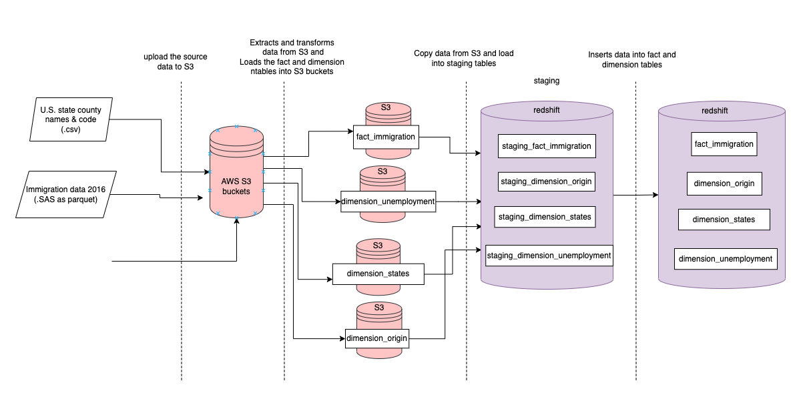
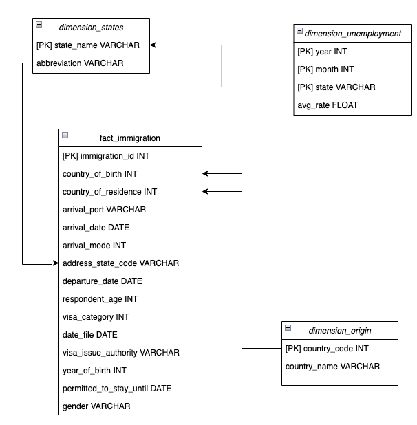
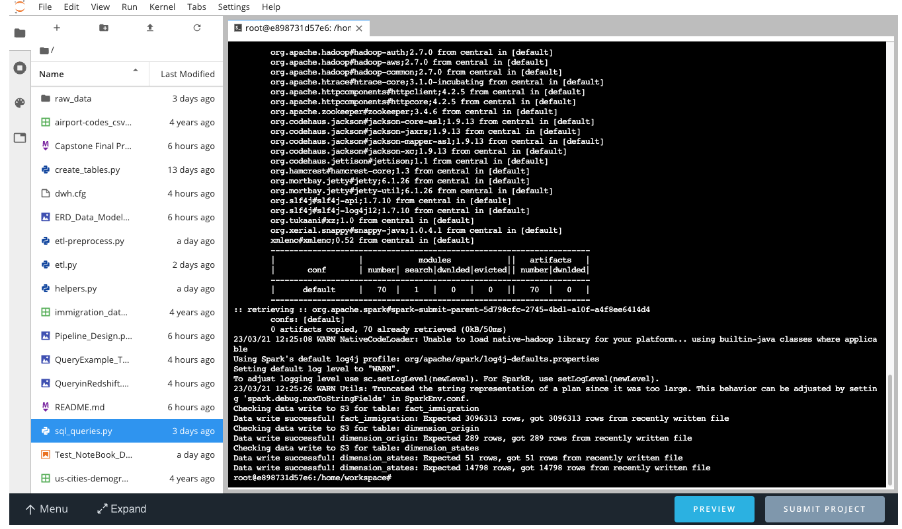
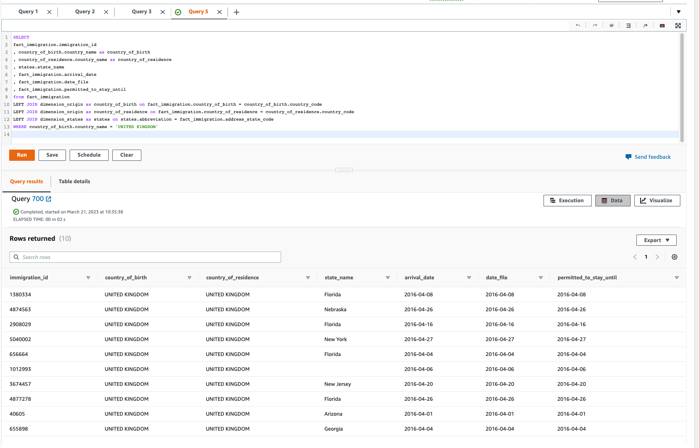

# Capstone Final Project

## Background of the data

The datasets provide data about immigration events in the U.S. for the year 2016. The data sources that make up this project are:
* I94 Immigration Data (.SAS format but shared a snappy.parquet files in the workspace) that is shared the US National Tourism and Trade Office ([link](https://travel.trade.gov/research/reports/i94/historical/2016.html)). 
* The data dictionary (.SAS format) provided to explain the I94 Immigration data above provided in the Udacity workspace for students. 
* U.S. state county name & codes (.csv format) is provided through Kaggle ([link](https://www.kaggle.com/datasets/stansilas/us-state-county-name-codes?select=states.csv))
* US Unemployment Rate by County (.csv format), 1990-2016 ([link](https://www.kaggle.com/datasets/jayrav13/unemployment-by-county-us))


## Goals of this project

Objective this project is to provide curated datasets that can be used for Analytics purposes. For example, the Analytics department can look at how immigration affects the unemployment rate in across the country.


## Detailed outline of the project

### Folder structure

- `raw_data/`: stores all raw data is uploaded to S3. 
- `dwh.config`: contains all configurations needed for the datalake and data warehouse.
- `helpers.py`: contains helper functions used by the `etl*.py` files (e.g.check_write_to_s3 which data quality checks all tables uploaded to S3 during the pre-processing)
- `sql_queries.py`: contains the SQL statements to run in Redshift
- `create_tables.py`: is the script to create tables in Redshift after the cluster has been set up for the first time. **Only run this once!**
- `etl-preprocess.py`: contains the Spark code for pre-processing the source datasets, from uploading to S3 to extraction to transformation.
- `etl.py`: follows pre-processing and contains the latter step of the data pipeline that involves more with Redshift. Run this only after having run `etl-preprocess.py`.


### Pipeline design

For the scope of this project, the ETL is split into two parts to avoid having all the tasks in one script that makes it more difficult to debug and cubersome to have to rerun through all steps because one of them failed. This obviously could be further improved by using a workflow scheduler such as Airflow, where we can define one task for one job, making it easier to debug and rerun the failed task and downstream tasks more elegantly. 



1. The pre-processing happens in `etl-preprocess.py`.
	* The data sources are first uploaded to S3 buckets so that data gets stored in the cloud for later retrieval, rather than suck on a single local machine.
	* Mostly Spark is used in the extraction and transformation step to account for the potential future growth of the datasets. For example, the I94 Immigration Data consists of only 2016 data of 3.1 million rows; if we want to add more years of data to this pipeline, other libraries such as `pandas` can't guarantee robust handling larger datasets. 
	* Transformation step includes: changing data types, converting dates, deduplication and renaming columns. For example, in the I94 Immigration Data, the arrdate should represent the arrival data of the immigrant, but is in numeric format (e.g.7397854), so it is converted into date format in this pre-processing step.
	* The result of the pre-process should produce fact and dimension tables (see more details in the Data Modeling section)
	* After pre-processing is done, we upload the tables back to S3. There is also a check to ensure that the write to S3 was successful. 

3. The `etl.py` part involves the loading in the data warehouse Redshift
	* The tables need to be created beforehand by running the `create_tables.py`. Note that this is a one-time run of the script needed for setting up this pipeline. Once the tables are created they don't need to be rerun as long as the cluster is running, i.e. in the case where the pipeline has been automated. 
	* The data from fact and dimension tables are copied from S3 into **staging tables** (denoted with `staging_` prefix). Staging tables are needed for performing upserts in Redshift. Since Redshift does not have upsert readily available, deletions (of matching records based on primary keys) are performed on the destination tables before new data is inserted. 
	* After deleting reccords from the target tables, the next step is inserting the data from the staging tables. 
	* Two data quality checks are run after insertion: (1) check that primary keys are not null, (2) check that primary keys are not duplicated. These are fundamental data quality checks, but more could be introduced such as checking the landing of the data by row count. 


## Data Modeling of this project


Choice of schema
Star schema is used for this project with fact table in the center and surrounding dimensions table (see ERD below).
- Processing data into a star schema helps the analysts and non-technical stakeholders to keep their queries simple. Even if the data is simple to understand, making our tables more normalised (e.g. further snowflaking or making tables into 3NF), creates additional query complexity due to the number of joins needed to produce a needed dataset.
- Having more joins due to highly normalised tables will make query performance suffer, as the data size can grow significantly.



From the raw data, the pipeline produces the following fact and dimension tables:
- Fact table `fact_immigration`: contains information about the act of a person immigrating into the U.S. (e.g. arrival date, country of residence, visa type). One row is one `immigration_id,` corresponding to an event of a person's file of immigration into the U.S.
- Dimension table `dimension_origin`: contains a mapping of country codes present in the fact table,  to country names. One row is one code that translates a country of origin. This will be used to mapping column `country_of_birth` and `country_of_residence` in the `fact_immigration` table.
- Dimension table `dimension_states`: contains the U.S. state and abbreviations to help identify the state present in the fact table. One row is one state and its official abbreviation. 
- Dimension table `dimension_unemployment`: contains the average monthly rate of unemployment for each state. The rate is an average calculation of all counties of a state.

The ERD shows how the fact and dimension tables are connected. For example, the country_of_birth in the fact_immigration table would be the foreign key of `country_code` in the `dimension_origin`

Assumptions about the data in each of modeled table
- Dimensions change over time and in this project we opt for handling changing dimensions as Type 1. If a dimension changes, the associated row will be updated during data insertion. There will be no tracking of old records in this strategy. This strategy is chosen because of the nature of the dimensions in this context. For example, if associated name in the country_origin changes, it makes more sense for our users to see the correct country of origin when they join this table to the fact table. 
- For the fact table, the assumption is that once a fact is populated in our raw data, this fact no longer changes. For this, we only insert new records into the `fact_immigration` table when processing the data.

### Data Dictionary

`fact_immigration`:
*	immigration_id: unique identifier marking the immigration file of a person entering the U.S.
*	country_of_birth: code of the country from where the immigration originates
*	country_of_residence: code of the residence country of the immigration
*	arrival_port: code of the port through which the immigrant is through
*	arrival_date: date of of arrival of the immigrant
*	arrival_mode: code representing mode of arrival
*	address_state_code: abbreviated code of address
*	departure_date: date when the immigrant departs
*	respondent_age: age of the immigrant
*	visa_category: type of the visa
*	date_file: date of the file
*	visa_issue_authority: code representing the authority that issued the visa 
*	year_of_birth: year of birth of the immigrant
*	permitted_to_stay_until: date until which the immigrant is allowed to remain in the U.S. 
*	gender: airline code

`dimension_origin`:
*	country_code: 3-digit code represent the country 
*	country_name: name of country (country of birth or place of residence).

`dimension_states`:
*	state_name: name of state
*	abbreviation: abbreviation used for the state

`dimension_unemployment`:
*	year: year
* 	month: numeric month
* 	state: state in the U.S.
* 	avg_rate: average unemployment rate


## Proposed solutions the following questions when accounting for growth

**Propose how often the data should be updated and why.**
- I would understand the stakeholder's need on how real-time they need to analyse the data.
- Since above is not available, I base my decision on the I94 Immigration Data. The unemployment data is publishing yearly data so this is not appropriate for deciding the data processing cadence. Looking at the I94 Immigration Dat sources, this data is published monthly, therefore it would make sense to run this monthly. 

**What happens if the data was increased by 100x?**
- In this project, such data increase will cause the ETL to run too slowly. Assuming that I would need to provide the stakeholders timely data:
*	I'd identify the runtime bottleneck. For example, it's the pre-processing step, I would break the dataset into smaller chunks to ingest and process at once. For example, I would process a day of data instead of the whole year of data and have the pipeline run more often.
*	 Consider applying encoding compression on large uncompressed columns (non sort key columns) to save storage space and additional I/O disk ([source](https://aws.amazon.com/blogs/big-data/top-10-performance-tuning-techniques-for-amazon-redshift/))
*	Once above has been optimise I would also consider increasing my compute nodes, by scaling horizontally. 


**What happens if the data populates a dashboard that must be updated on a daily basis by 7am every day.**
- The data pipeline would need to be automated using a scheduler (e.g. Airflow). 
- Using the job scheduler, we should define dependencies accounting for delays (i.e. not have things run right on 7am) as well as having an SLA to ensure that data lands before 7am. If the tasks miss this SLAs then the on-call engineer is notified through PagerDuty to be able to fix this timely.

**What happens if the database need to be accessed by 100+ people**
- Ensure that these users or their user groups are granted with the appropriate access privileges (e.g. analysts who query the data should not be able to insert, delete, update final tables).
- Query perfomrance might suffer, we can use the Advisor to check whether another distribution key and/or sort key should be used based on historical workload of the cluster.
- Educate stakeholders on how to query the tables efficiently, including running an EXPLAIN statement on more complex queries. 
- Use ANALYZE statements in the ET part of the pipeline to enable Redshift to choose a most cost-optimised plan to run queries ([source](https://aws.amazon.com/blogs/big-data/top-10-performance-tuning-techniques-for-amazon-redshift/))
- Consider using Workload Management to dynamically scale up or down memory and concurrency needed for the current load of queries ([tip 4](https://aws.amazon.com/blogs/big-data/top-10-performance-tuning-techniques-for-amazon-redshift/))
- Analyse query metrics using Redshift's query monitoring rules to understand heavy queries and set execute query priority based on these metrics ([tip 5](https://aws.amazon.com/blogs/big-data/top-10-performance-tuning-techniques-for-amazon-redshift/))


## Outcome of running scripts

### Data size requirements

**The project requires handling of at least 1 million rows of data.** This can be seen at the last step's logs of f the pre-processing `etl-preprocess.py` where we call `check_write_to_s3()` to run a row count check on the parquet data uploaded to S3 to ensure that it matches the dataframe that we use to upload. 

We can see in the log that there were 3096313 rows processed in the fact table based on this log message:

```
Data write successful! fact_immigration: Expected 3096313 rows, got 3096313 rows from recently written file 
```           




### Query example on final data

Below shows an example of a query that sources data from our fact and dimension tables that live in Redshift. Here we want to sample 10 immigration files of people whose country of birth is United Kingdom.

```
SELECT 
fact_immigration.immigration_id
, country_of_birth.country_name as country_of_birth
, country_of_residence.country_name as country_of_residence
, states.state_name
, fact_immigration.arrival_date
, fact_immigration.date_file
, fact_immigration.permitted_to_stay_until
from fact_immigration
LEFT JOIN dimension_origin as country_of_birth on fact_immigration.country_of_birth = country_of_birth.country_code
LEFT JOIN dimension_origin as country_of_residence on fact_immigration.country_of_residence = country_of_residence.country_code
LEFT JOIN dimension_states as states on states.abbreviation = fact_immigration.address_state_code
WHERE country_of_birth.country_name = 'UNITED KINGDOM'

```

Query result in Redshift




